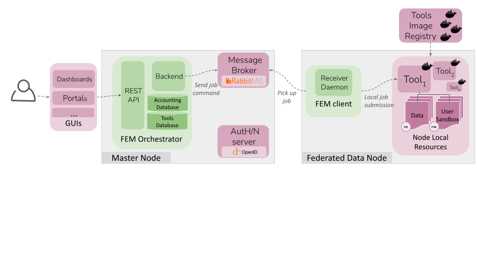

# Federated Execution Manager (FEM) - Orchestrator

The Federated Execution Manager (FEM) is a key component for coordinating and managing the execution of distributed tasks in a federated learning (FL) or decentralized computing environment. It enables the orchestration of multiple Federated Data Nodes (FDNs), where clients provide compute and data resources.

### :eight_pointed_black_star: Source code moved at https://gitlab.bsc.es/fl/fem-orchestrator 

# What is FEM?
The FEM is responsible for orchestrating and controlling the lifecycle of federated tasks across multiple FDNs. It consists of two primary components:

- **FEM Orchestrator**: Central controller that prepares, dispatches, and monitors tasks in a secure, coordinated manner.
- **FEM Client**: Installed on each FDN, this module receives tasks from the orchestrator, runs them, and manages the local execution environm

In essence, the FEM Orchestrator interacts with the FEM Client via a message broker (RabbitMQ), enabling seamless preparation, dispatching, coordination, and monitoring of federated tasks. The FEM framework supports distributed computing workflows such as federated learning experiments and other large-scale data processing tasks, ensuring secure communication between the federated participants.

The key functions of the FEM orchestrator include:
- **Task preparation**: configures tools and builds the appropriate command lines to ensure smooth execution.
- **Task federated scheduling**: Schedules tasks across FDNs with secure communication via the message broker and manages task queues for different nodes.
- **Task monitoring and accounting**:  Tracks the status of distributed tasks, logs executions, and ensures task accounting across the federation.
- **Data transference**: facilitates secure transfer of output files (if authorized) and logs from remote AI sandboxes back to the central reference node

# Related Repositories
- FEM-client: https://github.com/DataTools4Heart/FEM-client
- dt4h-FEM-client-config: https://github.com/DataTools4Heart/dt4h-FEM-client-config
